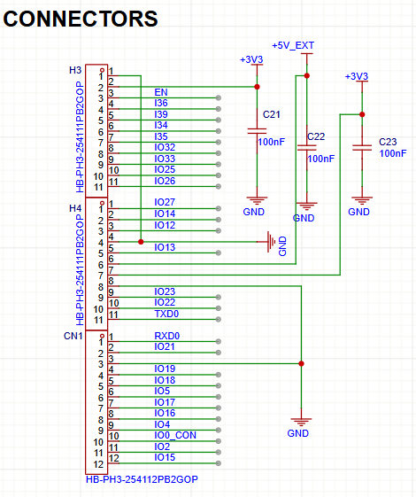
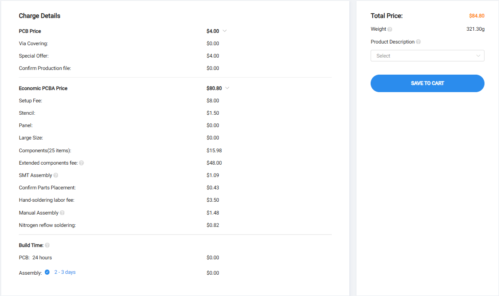
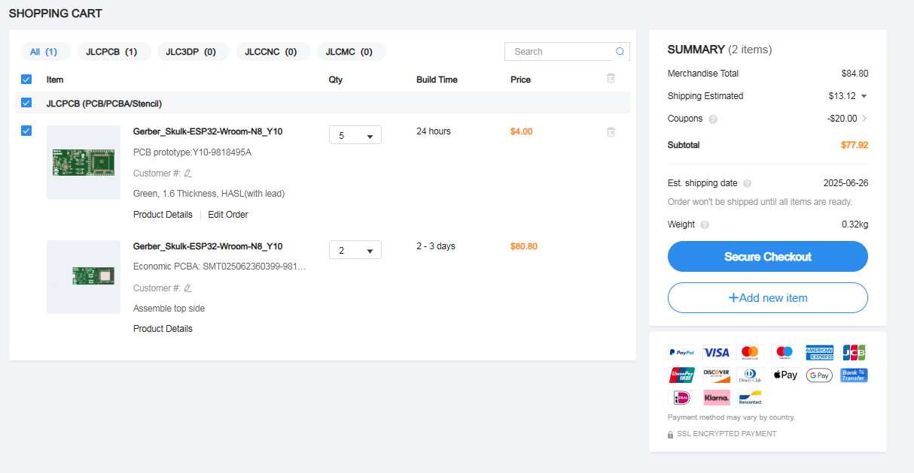

---Add commentMore actions
title: "Skulk Wroom N8"Add commentMore actions
author: "Navdeep"
description: "ESP32 Wroom (32E N8) Dev board with a good pin layout and is cool!"
created_at: "2025-05-29"
---
# Total time spent: 34h
# May 30th: Finally decided on the features.
Ok so as I was making an ESP32 dev board so I am thinking of just having it as a plain one and only making it as a very small and a board with a good pin layout.
**Total time spent: 1h**
# May 31st: Worked on logic and found parts.
Ok so I was using AI and it found some cool parts but I don't believe that it is good but still I think this is cheap and will soon find a tutorial for it but idk if someone has made one :(
**Total time spent: 1h**
# June 1st: I did plain systematic and I added 2 parts that should work.
Ok so I added the ESP32-Wroom-32E-N8 and the Micro USB now I am trying to connect them as now I have most of the capacitors and resistor ready and soon will attach the nets.

**Total time spent: 2h**
# June 2nd: I loved the pain I had today
Uhh yeah I had a lot of pain today as what I was trying to do didn't work as I thought I could directly connect Micro USB to ESP32 but I need a serial converter too that has taken 3hrs to setup and hopefully it will work

**Total time spent: 3h**
# June 3rd: Added the power and voltage regulators.
After fixing the mess of the project schematic I added power and voltage regulators so that it gets properly in powered.

**Total time spent: 2h**
# June 4th: Added connector and leds.
Ok so I added connectors that are male connectors and I added 2 connectors with 11 pins each and added 1 with 12 pins the 12 pins connector has gold layering for looks because why not? The user and boot leds are green and red and they were easy to add for now

**Total time spent: 2h**
# June 5th: PCB time!
Today I had ups and downs so I made a PCB layout and then auto routed it (ai said so buts it's a liar)

then I got to know that I need to learn a lil more about routing so I watched some videos and unrouted my PCB and re organised my layout that's it and Tommorow I will again start with manual routing.
**Total time spent: 5h**
# June 6th: Manual PCB time!
Ok so I started doing manual routing and then gave myself a big slap because I did the layout incorrectly aghh then I did re layout and now I'm done kinda halfway like 12 pins are connected so let's see where i can reach Tomorrow.
**Total time spent: 4h**
# June 7th: Routing time:)
Yay I got everything connected and now I have to only do the GND and +3v3 nets and they will probably be done till tomorrow. Also I am thinking of naming it Skulk ESP32 Wroom N8 and the PCB is now a 6 layer one and will be a load more expensive but lets see tomorrow.

# June 8th: finished and submited!
ahh update time so today is a mid day update and its about my pcb!!! so today in the moring i realized that 6layer PCB costs way more and will not get accep ted so I was back rerouting everything to just 4 layers as thats the best fit for me, well that took about 5 hours and then I got the SKULK logo as a silkscreen and that was it for the PCB!!

So after my PCB final I started going crazy with happyness and then tried ordering it manually to just figure out the price and It took a lil bit of time but then I settled on $83.23 including shipping. 

and here i am writing my last journal before I submit this!!!
**Total time spent: 8h**
# June 9th: Little tweaks
I just submitted it on 8th and now I had to do some little tweaks to the PCB as I had 2 parts that were out of stock and now I have changes their placement and now I am waiting for apporoval on my project btw I need $86.33 now because I have different parts now.

2nd update: I got rejected because I had a 4 layer PCB and now I have to change it to 2 layers and then re submit it.
**Total time spent: 2h**
# June 10th: Redone PCB and resubmitted
Ok so I had to redo the PCB layout to fit the 2 layer requirement and that took a lot of time to reorganize everything. I had to make sure that all the connections were still valid and that the design rules were followed. After a long day of work, I finally managed to get it done and resubmitted it for approval.here is the final PCB layout:

and here is the final 3D render:

now here is what JLCPCB is costing me:

**Total time spent: 8h**