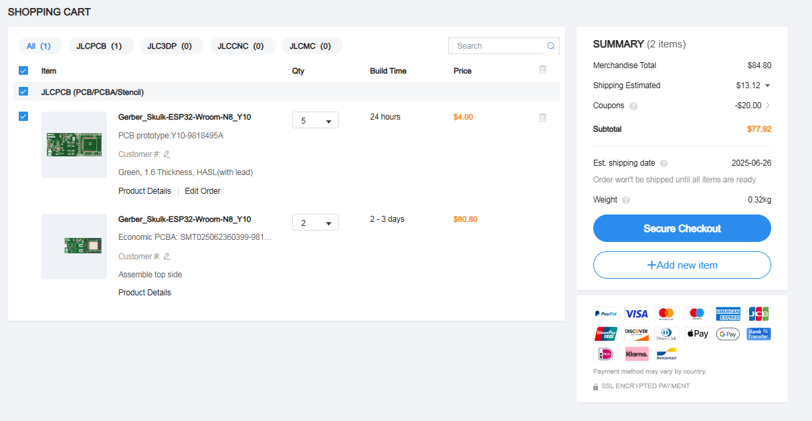

# Skulk Wroom N8
3x8cm ESP32 Wroom (32E N8) Dev board with a good pin layout and is cool!
> Designed by **Navdeep** · Sponsered by **Highway** (A Hack Club Event) · Made to learn!
---
## Why I want to make this
I wanted to make this as my first dev board and learn routing skillls also I have been working with ESP32 a little but its pin layout wasnt that good so I designed my own!
## Features

- **ESP32-WROOM-32E N8** module (8MB Flash, dual-core, Wi-Fi + Bluetooth)
- **CP2102N-A02-GQFN28R** USB-to-Serial chip for stable programming
- **3.3V LDO Regulator** for not frying the board
- **All Pins broken out** into male headers 
- **Reset & Boot buttons** for manual flashing
- **Power LED** and **User LED** (on GPIO2)
- **Supports 5V VIN input** via USB-B or external header
---
## Costs and BOM
The full order of 5 PCB's and 2 PCBa cost $77.63 including. The price of each board is around $38.815 including shipping.
> You can find the BOM in CVS format [here](https://github.com/Navdeep-Codes/Skulk-Wroom-N8/blob/main/Files/PAP_Skulk-ESP32-Wroom-N8.csv).

---
# Pictures
## 3D Render
### Top

### Bottom

## PCB Image

## Schematic
You can find the schematic in PDF format [here](https://github.com/Navdeep-Codes/Skulk-Wroom-N8/blob/main/Files/SCH_Skulk-ESP32-Wroom-N8.pdf).
## Pinout
### Pinout diagram coming soon as PDF and PNG.
---
# Made with 💖 by Navdeep - Skulk 
